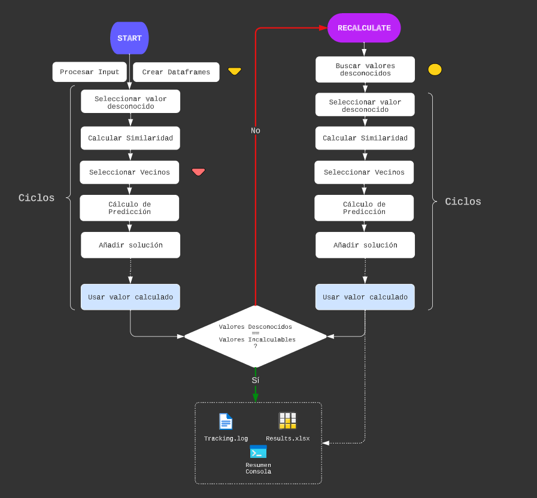

# **Sistema de recomendación: Métodos de filtrado colaborativo**
___Participantes___:

- Eduardo González Pérez - alu0101319001@ull.edu.es 
- Jonathan Martínez Pérez - alu0101254098@ull.edu.es

## Contenido
  - [Instrucciones de instalación de dependencias](#id0)
  - [Descripción del código desarrollado](#id1)
  - [Ejemplo de uso](#id2)

## Instrucciones de instalación de dependencias
Para poder emplear nuestro código, se tendrá que realizar un `git clone` de este repositorio y contar, en la máquina donde ejecutaremos el mismo, los siguientes elementos:
- __Python__: nuestro código se ha realizado en el lenguaje de programación Python. Por este motivo, será necesario tener instalado ___Python3___. En caso de no tenerlo, si nos encontramos en una máquina Linux, se debería realizar los siguientes comandos: `sudo apt update`  y  `sudo apt install python3`.
  
- __Librerías__: para la realización de esta práctica se emplea las siguientes librerías, las cuáles podremos instalar mediante el comando `pip install [libreria]`:
  - ___numpy___ : soporte para matrices multidimensionales y colección de funciones matemáticas de alto nivel.
  - ___pandas___ : especializada en la manipulación y el análisis de datos.
  - ___logging___ : sistema de registro de eventos flexible.
  - ___argparse___ : procesamiento de la línea de comando de forma flexible y con funcionalidades adicionales.
  - ___openpyxl___ : lectura y escritura de ficheros excel xlsx/xlsm/xltx/xltm.

## Descripción del código desarrollado
El problema a tratar se fundamenta en obtener de una matriz con valores desconocidos, la predicción de los mismos, a través de una serie de diversos métodos, cálculos y selecciones. En concreto, aplicando la __metodología del filtrado colaborativo orientado a usuarios__, nos fijaremos en la similitud entre los usuarios para llegar a realizar una predicción estimada de la calificación de un usuario a un ítem determinado. 

Con el objetivo de implementar esta mecánica, se ha desarrollado un código en python compuesto por dos ficheros: 

- __recommender_main__ : el fichero principal a ejecutar. Obtiene por línea de comandos los datos de entrada: nombre del ___fichero___ en que se encuentra codificada la mátriz de utilidad a considerar; ___métrica___ deseada, optando entre `pearson`, `cosine` y `euclidean`; número de ___vecinos___ a considerar, siendo este un entero; ___predicción___ deseada entre `simple` o `media`; y por último la elección de ___usar los valores desconocidos resuletos___ en los siguientes cálculos, activandose con el añadido `--use_nan`. Con estos datos, se crea un objeto de la clase `C_F_Recommender`, a comentar a continuación, y se inicia el proceso de la definición de los valores desconocidos.

- __c_f_recommender_class_with_log__ : el funcionamiento principal, reside en las funciones `start()` y `recalculate()`. En la primera, tras el procesamiento y creación de la estructura básica de datos sobre la que trabajar, comienza a realizarse una serie de __ciclos__, hasta que la lista de valores desconocidos a seleccionar se termine. Al obtener la nueva matriz de utilidad con los valores desconocidos calculados incorporados, se realizará tantos procesos de recálculo como sea necesarios, hasta que no existan más valores desconocidos a resolver o bien, los que hay son incalculables. Este flujo se puede encontrar representado en la imágen que se muestra a continuación.
  

Siguiendo esta representación, se puede comentar las decisiones de implementación que se han seguido, así como particularidades: 

- __Selección__ : para realizar el proceso de selección del valor desconocido a calcular, se dará prioridad al usuario con __menor número de valores desconocidos__, y como desempate, se seleccionará entre esta preselección al ítem con menor número de valores desconocidos. Si dentro de esta selección final, también existen empates, se seleccionará el primero ubicado.

- __Filtros__ : determinan que algunos de estos valores desconocidos, en ese preciso momento, son __incalculables__. El lugar de estos filtros son representados en nuestra imágen por los símbolos triangulares: en el __filtro amarillo__ se descartan aquellos valores desconocidos de ítems que no tienen, como mínimo, una valoración de algún usuario; y en el __filtro rojo__  en la selección de los vecinos, en base a sus similaridades con el usuario seleccionado, se descartaran tanto aquellos usuarios que no han valorado el ítem en cuestión, como aquellas similitudes calculadas con valor negativo, 0.0 o NaN. 

- __Recalculate__ : al terminar la función `start()`, obtenemos una matriz de utilidad que incluye las predicciones recién calculadas. Sin embargo, a causa de los filtros previamente explicados, se puede dar el caso que un valor desconocido etiquetado como incalculable, con el estado final de la matriz de utilidad puede ser calculado. De esta forma, repetiremos el proceso al completo en la función `recalculate()` tantas veces hasta que los valores desconocidos al principio del recálculo sean los mismos que los valores marcados como incalculables al final del proceso. De esta forma, se señalan tres __puntos de parada__ para este bucle: 
  - No hay más valores desconocidos a calcular en la matriz de utilidad.
  - No hay ningún valor desconocido válido (que pase los filtros) a calcular.
  - Los valores desconocidos al principio del proceso son los mismos que los valores incalculables al final.

    Por lo tanto, los dos primeros puntos de parada son determinados en el __punto amarillo__ señalado en nuestro gráfico. Mientras que el último punto de parada se trata del final natural del proceso.

- __Salida__ : como salida final del programa, contaremos con tres formatos que se devolverán de forma simultánea. Por un lado, obtendremos un fichero denominado `tracking.log`, consistente en un seguimiento paso por paso del proceso completo. Y por el otro lado, obtendremos el resultado del proceso reunido en tres dataframes: la __matriz de utilidad resuelta__, una tabla con la __similaridad entre vecinos__, y una __tabla de la solución__, en la que se indica cada valor desconocido resuleto, su predicción y los vecinos considerados. Para mostrar estos resultados, se siguen dos formas: tendremos un __resumen__ de estos resultados impresos por la __consola__ y un __fichero excel__ que constá de tres hojas en las que se ubican las tres tablas mencionadas. Esto se ha determinado así por la imposibilidad de visualizar correctamente los resultados de matrices de gran tamaño por la consola.

- __Particularidades Variadas__ : existen decisiones concretas a lo largo de la ejecución a considerar:
  - __Número mínimo de vecinos__ : en la ejecución se introduce un número de vecinos a considerar para la selección, sin embargo, en el caso de que el número de vecinos viables sea menor al número indicado pero mayor al mínimo absoluto de vecinos a considerar (establecido en 1), se realizará el cálculo de la predicción con los vecinos disponibles. Sin embargo, no se considerará una predicción viable, ya que no cumple con los estándares que se exigía en la entrada, por lo que este valor, a pesar de ser calculado, no se añadirá en ningún momento a la matriz de utilidad. En la tabla de soluciones, estos casos vienen marcados por un __"*"__ al lado del valor de la solución. Si el número de vecinos viables es menor incluso al mínimo absoluto, el valor desconocido permanecerá como tal.
  - __Casos extraños en las similitudes__ : en las situaciones en que se detecten casos fuera de lo previsto, el valor de la similitud se establecerá como NaN.
  - __Límite de valores calculados__ : en aquellos extraños casos en que el valor desconocido calculado salga del rango fijado de calificaciones, será aproximado al mínimo o máximo, según corresponda al exceso.

## Modo de uso
Para ejecutar el código, se debe seguir una línea de ejecución en este formato: 

> python3 recommender_main.py --read examples-utility-matrices/utility-matrix-___[x]___-___[y]___-___[version]___.txt --metrics ___[pearson, cosine, euclidean]___ --neighbors ___[int]___ --prediction ___[simple, media]___ ___[--use_nan]___

En el fichero [how_execute_with_args.md](./how_execute_with_args.md) se muestran varios ejemplos de líneas de ejecución ya predefinidas y calificadas. El código debe ser ejecutado dentro de la carpeta Code.

Recordar que la salida del programa se muestra en tres formatos. Si desea un resumen de la solución, podrá verlo en la __consola__. La solución completa podrá visualizarse en el fichero `results.xlsx` generado. Por último, el seguimiento completo paso por paso del proceso del código puede verse en el fichero `tracking.log`.

